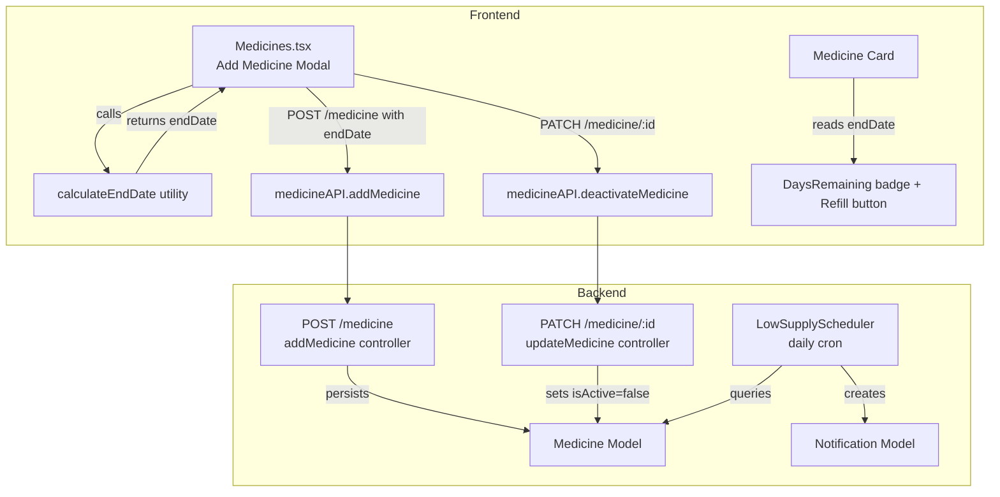

# Design Document: Medicine End Date Calculator

## Overview

This feature extends MediVault's medicine management flow so patients can enter pack quantity details (total tablets, tablets per dose, doses per day) when adding a medicine. A client-side utility function derives the supply end date from those inputs, previews it in the Add Medicine modal in real time, and persists it to the existing `endDate` field on the Medicine model. The medicine list card is updated to surface days-remaining status and a contextual Refill button. A new backend scheduler fires a daily low-supply push notification when a medicine is 5 days from running out.

---

## Architecture



The feature is primarily additive: new fields on the Medicine model, new UI controls in the modal, new card UI, a new scheduler, and a thin new PATCH endpoint. No existing data flows are broken.

---

## Components and Interfaces

### 1. `calculateEndDate` utility (frontend)

**File:** `frontend/utils/calculateEndDate.ts`

```ts
export function calculateEndDate(
  totalTablets: number,
  tabletsPerDose: number,
  dosesPerDay: number,
  startDate?: Date
): Date
```

- `startDate` defaults to today at midnight local time when omitted.
- Returns `startDate + Math.floor(totalTablets / (tabletsPerDose * dosesPerDay))` days.
- Throws (or returns `null`) if any argument is ≤ 0.

### 2. `Stepper` component (frontend)

**File:** `frontend/components/Stepper.tsx`

```ts
interface StepperProps {
  value: number;
  onChange: (value: number) => void;
  min?: number;       // default 1
  max?: number;
  step?: number;      // default 1
  label?: string;
}
```

Renders: `[−]  <numeric display / TextInput>  [+]`

- Decrement button is disabled when `value <= min`.
- Tapping the numeric display opens a keyboard for direct entry; on blur, values below `min` are clamped to `min`.

### 3. Add Medicine Modal changes (`Medicines.tsx`)

New state fields added to `newMed`:

```ts
totalTablets: number;       // default 30
tabletsPerDose: number;     // default 1
dosesPerDay: number;        // default 1
```

New derived state (computed via `useMemo`):

```ts
const previewEndDate: Date | null = useMemo(() => {
  if (totalTablets > 0 && tabletsPerDose > 0 && dosesPerDay > 0)
    return calculateEndDate(totalTablets, tabletsPerDose, dosesPerDay);
  return null;
}, [totalTablets, tabletsPerDose, dosesPerDay]);
```

Preview row (shown only when `previewEndDate !== null`):

```
Runs out [MMM D] · [N] days
```

Frequency chip selection pre-populates `dosesPerDay`:

| Chip | dosesPerDay |
|------|-------------|
| daily | 1 |
| twice daily | 2 |
| thrice daily | 3 |
| weekly | 0.143 (≈ 1/7) |
| as needed | 1 |

### 4. Medicine Card changes (`Medicines.tsx`)

New helper `getDaysRemaining(endDate: string): number`:

```ts
Math.floor((new Date(endDate).setHours(0,0,0,0) - todayMidnight) / msPerDay)
```

New UI elements per card (when `endDate` is present):

- End date text coloured by proximity (warning ≤ 7 days, danger if past).
- `DaysRemaining` badge with text per requirement 8.
- `Refill` button visible when `daysRemaining <= 7`.

Refill flow:
1. Pre-fills modal with existing medicine's `name`, `dosage`, `frequency`, `timeSlots`.
2. Pack quantity fields start empty/default.
3. On successful save → `deactivateMedicine(originalId)`.

### 5. Backend: Medicine model schema update

**File:** `backend/src/models/Medicine.js`

Add two optional numeric fields:

```js
totalTablets: { type: Number, min: 1 },
tabletsPerDose: { type: Number, min: 1 },
```

`endDate` already exists as an optional `Date` — no change needed.

### 6. Backend: `addMedicine` controller update

**File:** `backend/src/controllers/medicineController.js`

Destructure `totalTablets` and `tabletsPerDose` from `req.body` and pass them to `Medicine.create(...)`. No calculation is performed server-side; the frontend sends the already-computed `endDate`.

### 7. Backend: `PATCH /medicine/:id` endpoint

New controller function `updateMedicine`:

```js
const updateMedicine = async (req, res, next) => {
  // Allows patching isActive (and optionally other safe fields)
  // Validates ownership: medicine.patientId === req.user.id
};
```

Route: `PATCH /medicine/:id` (authenticated, patient role).

### 8. Backend: `LowSupplyScheduler`

**File:** `backend/src/schedulers/lowSupplyScheduler.js`

- Runs once per day via `node-cron` (`0 8 * * *` — 08:00 local).
- Queries `Medicine.find({ isActive: true, endDate: { $gte: fiveDaysStart, $lte: fiveDaysEnd } })`.
- For each match, checks for an existing `low_supply` notification for the same medicine on the same calendar day (dedup).
- Creates `Notification` with `type: "low_supply"`, `title: "Low Supply Reminder"`, `message: "Your supply of [name] runs out in 5 days. Time to refill!"`.
- Errors per medicine are caught individually; the loop continues.

### 9. Notification model enum update

**File:** `backend/src/models/Notification.js`

Add `"low_supply"` to the `type` enum array.

### 10. Frontend API service updates

**File:** `frontend/services/api.ts`

- `addMedicine` payload type: add `totalTablets?: number` and `tabletsPerDose?: number`.
- New function `deactivateMedicine(id: string): Promise<void>` — calls `PATCH /medicine/:id` with `{ isActive: false }`.
- `Medicine` interface: add `totalTablets?: number` and `tabletsPerDose?: number`.

---

## Data Models

### Medicine (updated)

```
Medicine {
  _id:             ObjectId
  patientId:       ObjectId (ref: User)
  name:            String (required)
  dosage:          String (required)
  frequency:       String (default: "daily")
  timeSlots:       [String]
  startDate:       Date (required, default: now)
  endDate:         Date (optional)          ← existing, now populated by calculator
  totalTablets:    Number (optional, min:1) ← NEW
  tabletsPerDose:  Number (optional, min:1) ← NEW
  instructions:    String (optional)
  isActive:        Boolean (default: true)
  createdAt:       Date
  updatedAt:       Date
}
```

### Notification (updated enum)

```
type enum: [
  "dose_missed",
  "dose_missed_caregiver",
  "dose_daily_summary",
  "dose_reminder",
  "symptom_urgent",
  "system",
  "low_supply"   ← NEW
]
```

### LowSupplyScheduler query window

For a run at date `D`:
- `fiveDaysStart` = midnight of `D + 5`
- `fiveDaysEnd`   = 23:59:59.999 of `D + 5`

Dedup key stored in notification metadata: `{ medicineId, schedulerDate }` where `schedulerDate` is the ISO date string of `D`.

---

## Correctness Properties

*A property is a characteristic or behavior that should hold true across all valid executions of a system — essentially, a formal statement about what the system should do. Properties serve as the bridge between human-readable specifications and machine-verifiable correctness guarantees.*

### Property 1: Calculator round-trip correctness

*For any* valid combination of `totalTablets` T > 0, `tabletsPerDose` D > 0, and `dosesPerDay` F > 0 (including non-integer F), calling `calculateEndDate(T, D, F, startDate)` and then computing `(result - startDate) / msPerDay` (where both dates are at midnight) SHALL equal `Math.floor(T / (D * F))`.

**Validates: Requirements 2.1, 2.5, 5.1, 5.2, 5.4, 5.5, 7.2**

---

### Property 2: Pack input validation rejection

*For any* value of `totalTablets` < 1, `tabletsPerDose` < 1, or `dosesPerDay` < 0.01, the Add Medicine form submission SHALL be rejected and the medicine list SHALL remain unchanged.

**Validates: Requirements 1.5, 1.6, 1.7**

---

### Property 3: End date and badge colour selection by days remaining

*For any* medicine with an `endDate`, the colour used to render the end date text and the DaysRemaining badge SHALL be `colors.warning` when `daysRemaining` is in [0, 7], `colors.danger` when `daysRemaining` is negative, and the default text colour otherwise.

**Validates: Requirements 4.3, 4.4, 8.6, 8.7**

---

### Property 4: DaysRemaining badge text for positive N

*For any* medicine with `daysRemaining` > 1, the badge text SHALL be `"[N] days left"` where N equals the computed integer days remaining.

**Validates: Requirements 8.2**

---

### Property 5: DaysRemaining badge text for expired medicines

*For any* medicine with `daysRemaining` < 0, the badge text SHALL be `"Expired [|daysRemaining|] days ago"`.

**Validates: Requirements 8.5**

---

### Property 6: Refill button visibility

*For any* medicine with `daysRemaining <= 7` (including negative values), the Medicine Card SHALL display a "Refill" button; for medicines with `daysRemaining > 7` or no `endDate`, no Refill button SHALL be shown.

**Validates: Requirements 9.1**

---

### Property 7: Stepper increment and decrement

*For any* Stepper with current value V and minimum M, pressing the increment button SHALL produce V + 1, and pressing the decrement button when V > M SHALL produce V − 1.

**Validates: Requirements 6.3, 6.4**

---

### Property 8: Stepper minimum clamping

*For any* Stepper with minimum M = 1, the decrement button SHALL be disabled when V = 1, and any direct keyboard entry resulting in a value < 1 SHALL be clamped to 1 on blur.

**Validates: Requirements 6.2, 6.6**

---

### Property 9: Preview row format

*For any* valid combination of pack inputs, the preview row text SHALL match the pattern `"Runs out [MMM D] · [N] days"` where N equals `Math.floor(T / (D * F))` and the date is formatted as abbreviated month + day.

**Validates: Requirements 7.1**

---

### Property 10: Refill failure does not deactivate original medicine

*For any* refill attempt where the new medicine creation fails, the original medicine record SHALL remain active (`isActive: true`) and SHALL still appear in the active medicines list.

**Validates: Requirements 9.5**

---

### Property 11: Inactive medicine excluded from active list

*For any* medicine record with `isActive: false`, a query for the patient's active medicines SHALL not include that record.

**Validates: Requirements 9.6**

---

### Property 12: LowSupplyScheduler selects correct medicines

*For any* set of active Medicine records, the LowSupplyScheduler SHALL select exactly those records whose `endDate` falls within the calendar day that is 5 days from the scheduler's run date — no more, no fewer.

**Validates: Requirements 10.1**

---

### Property 13: LowSupplyScheduler notification fields

*For any* medicine selected by the LowSupplyScheduler, the created Notification SHALL have `type: "low_supply"`, `title: "Low Supply Reminder"`, `message` containing the medicine name, and `userId` equal to the medicine's `patientId`.

**Validates: Requirements 10.2, 10.3**

---

### Property 14: LowSupplyScheduler idempotence

*For any* medicine, running the LowSupplyScheduler twice on the same calendar day SHALL result in exactly one `"low_supply"` notification for that medicine on that day — not two.

**Validates: Requirements 10.4**

---

### Property 15: LowSupplyScheduler error resilience

*For any* batch of medicines where processing one medicine throws a database error, the LowSupplyScheduler SHALL still process all remaining medicines in the batch.

**Validates: Requirements 10.6**

---

### Property 16: endDate round-trip through controller

*For any* valid ISO date string sent as `endDate` in a `POST /medicine` request, the persisted Medicine document's `endDate` field SHALL equal the original value when parsed back to a Date.

**Validates: Requirements 3.2**

---

## Error Handling

### Frontend

| Scenario | Handling |
|---|---|
| Pack fields < minimum on submit | Inline validation error below the field; form submission blocked |
| `calculateEndDate` receives invalid args | Returns `null`; preview row is hidden |
| `addMedicine` API call fails | `Alert.alert` with error message; modal stays open |
| `deactivateMedicine` (PATCH) fails after successful new medicine save | Log warning; show non-blocking toast; original medicine remains active (user can manually delete) |
| Network timeout during refill | Error alert; no deactivation attempted |

### Backend

| Scenario | Handling |
|---|---|
| `POST /medicine` missing `name` or `dosage` | 400 with `"name and dosage are required fields."` |
| `PATCH /medicine/:id` — medicine not found or wrong patient | 404 |
| `PATCH /medicine/:id` — invalid ObjectId | 400 |
| LowSupplyScheduler — DB error on individual medicine | `console.error` + continue loop; no crash |
| LowSupplyScheduler — catastrophic DB failure | `console.error` at top level; cron job survives for next run |

---

## Testing Strategy

### Dual Testing Approach

Both unit tests and property-based tests are required. Unit tests cover specific examples, integration points, and edge cases. Property-based tests verify universal correctness across randomised inputs.

### Property-Based Testing Library

- **Frontend (TypeScript/React Native):** [`fast-check`](https://github.com/dubzzz/fast-check)
- **Backend (Node.js):** [`fast-check`](https://github.com/dubzzz/fast-check) (works in Jest)

Each property test MUST run a minimum of **100 iterations**.

Each property test MUST include a comment tag in the format:
```
// Feature: medicine-end-date-calculator, Property N: <property_text>
```

### Property Tests

Each correctness property maps to exactly one property-based test:

| Property | Test file | Arbitraries |
|---|---|---|
| P1 — Calculator round-trip | `frontend/__tests__/calculateEndDate.property.test.ts` | `fc.integer({min:1,max:1000})` × 3 + `fc.float({min:0.01})` for F |
| P2 — Pack input validation rejection | `frontend/__tests__/Medicines.property.test.tsx` | `fc.integer({max:0})` for invalid values |
| P3 — Colour selection by days remaining | `frontend/__tests__/MedicineCard.property.test.tsx` | `fc.integer({min:-365,max:365})` for daysRemaining |
| P4 — Badge text N > 1 | `frontend/__tests__/MedicineCard.property.test.tsx` | `fc.integer({min:2,max:9999})` |
| P5 — Badge text expired | `frontend/__tests__/MedicineCard.property.test.tsx` | `fc.integer({max:-1})` |
| P6 — Refill button visibility | `frontend/__tests__/MedicineCard.property.test.tsx` | `fc.integer({min:-365,max:365})` |
| P7 — Stepper increment/decrement | `frontend/__tests__/Stepper.property.test.tsx` | `fc.integer({min:2,max:1000})` for V |
| P8 — Stepper minimum clamping | `frontend/__tests__/Stepper.property.test.tsx` | `fc.integer({max:0})` for invalid entry |
| P9 — Preview row format | `frontend/__tests__/Medicines.property.test.tsx` | valid T, D, F arbitraries |
| P10 — Refill failure no deactivation | `frontend/__tests__/Medicines.property.test.tsx` | mock API failure scenarios |
| P11 — Inactive medicine excluded | `backend/tests/medicine.property.test.js` | random medicine sets |
| P12 — Scheduler selects correct medicines | `backend/tests/lowSupplyScheduler.property.test.js` | random endDate distributions |
| P13 — Scheduler notification fields | `backend/tests/lowSupplyScheduler.property.test.js` | random medicine records |
| P14 — Scheduler idempotence | `backend/tests/lowSupplyScheduler.property.test.js` | random medicine records |
| P15 — Scheduler error resilience | `backend/tests/lowSupplyScheduler.property.test.js` | random error injection |
| P16 — endDate round-trip controller | `backend/tests/medicine.property.test.js` | `fc.date()` |

### Unit Tests

Unit tests focus on:

- **`calculateEndDate`**: exact divisibility (5.1), non-divisibility (5.2), zero-supply edge case (5.3), non-integer dosesPerDay (5.4), missing startDate defaults to today (2.4).
- **Frequency chip → dosesPerDay mapping**: all 5 frequency values (1.4).
- **Preview row**: singular "1 day" display (7.3), hidden when inputs invalid (2.3/7.4).
- **DaysRemaining badge**: exactly 0 → "Refill today" (8.4), exactly 1 → "1 day left" (8.3), no endDate → no badge (8.8).
- **Medicine Card**: no endDate → no trailing separator (4.2).
- **Notification model**: `"low_supply"` accepted by enum (10.5).
- **`addMedicine` controller**: `totalTablets` and `tabletsPerDose` persisted (3.2 example), omitted pack fields → `endDate` undefined (3.3).
- **`PATCH /medicine/:id`**: ownership check, 404 on missing, 400 on invalid ID.
- **Refill flow integration**: pre-fill values copied correctly (9.2), new record startDate is today (9.3), original deactivated on success (9.4).
